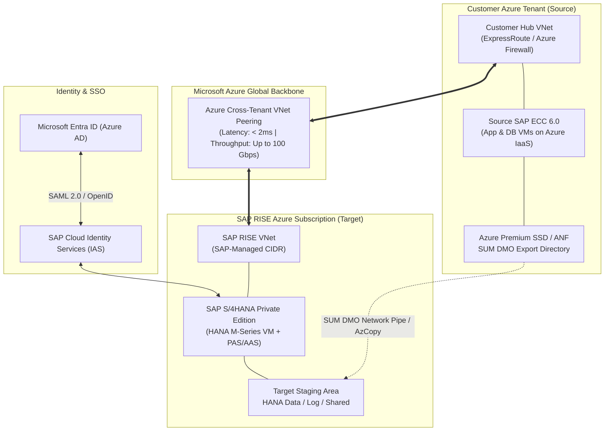

# SAP ECC 6.0 on Azure IaaS to RISE with SAP S/4HANA Cloud Private Edition Migration Kit

Welcome to the technical migration framework and documentation repository for transitioning an **SAP ECC 6.0 landscape hosted on customer-managed Microsoft Azure IaaS** to **RISE with SAP S/4HANA Cloud Private Edition** (hosted in an SAP-managed Azure subscription).

---

## 1. Executive Summary & Objective

This repository contains the architecture, operating model, technical execution runbooks, and readiness checklists required to convert and migrate SAP ECC 6.0 to RISE with SAP S/4HANA Cloud Private Edition.

### Key Characteristics of this Migration
- **Source Environment:** SAP ECC 6.0 (AnyDB or SAP HANA) running on Customer-managed Azure Virtual Machines.
- **Target Environment:** SAP S/4HANA Cloud Private Edition running in an SAP-managed Azure Subscription under the RISE with SAP commercial and operational umbrella.
- **Primary Migration Strategy:** Brownfield System Conversion using **SAP Software Update Manager (SUM) with Database Migration Option (DMO) - System Move**.
- **Network Pipeline:** High-speed cross-tenant **Azure VNet Peering** connecting Customer Hub/Spoke VNets directly to the SAP RISE VNet for ultra-fast data transfer and low-latency interface connectivity.

---

## 2. Repository Layout

```
sap_migration/
├── README.md                                # Project overview, quickstart & methodology
├── architecture/
│   └── network_and_sizing_spec.md           # Cross-tenant VNet peering, CIDR, DMO data pipe & sizing
├── governance/
│   └── raci_matrix.md                       # Customer vs. SAP ECS vs. System Integrator RACI
├── checklists/
│   └── cvi_readiness_checklist.md           # ECC 6.0 Customer-Vendor Integration (CVI) steps
├── runbooks/
│   ├── post_migration_and_hypercare_guide.md # Post-cutover stabilization, SU25, incident SLAs & hypercare
│   ├── sum_dmo_execution_guide.md            # Hands-on SUM DMO System Move command & screen guide
│   └── technical_cutover_runbook.md           # Minute-by-minute Cutover Weekend execution plan
```

---

## 3. High-Level Migration Architecture



---

## 4. SAP Activate Methodology Alignment

| Phase | Core Focus Areas | Workspace Deliverables |
| :--- | :--- | :--- |
| **Discover** | Readiness Check, Simplification Item Catalog, Sizing | [network_and_sizing_spec.md](file:///Users/priyankapalo/Downloads/sap_migration/architecture/network_and_sizing_spec.md) |
| **Prepare** | Network setup, VNet Peering, Project Charter, RACI alignment | [raci_matrix.md](file:///Users/priyankapalo/Downloads/sap_migration/governance/raci_matrix.md) |
| **Explore** | Fit-to-Standard workshops, CVI prerequisite synchronization | [cvi_readiness_checklist.md](file:///Users/priyankapalo/Downloads/sap_migration/checklists/cvi_readiness_checklist.md) |
| **Realize** | Custom code remediation, Sandbox & Mock conversion iterations | [sum_dmo_execution_guide.md](file:///Users/priyankapalo/Downloads/sap_migration/runbooks/sum_dmo_execution_guide.md) & [technical_cutover_runbook.md](file:///Users/priyankapalo/Downloads/sap_migration/runbooks/technical_cutover_runbook.md) |
| **Deploy** | Dress rehearsal, Go/No-Go gate, Production Cutover weekend | [technical_cutover_runbook.md](file:///Users/priyankapalo/Downloads/sap_migration/runbooks/technical_cutover_runbook.md) |
| **Run** | Hypercare, operational handover to SAP Enterprise Cloud Services (ECS) | [post_migration_and_hypercare_guide.md](file:///Users/priyankapalo/Downloads/sap_migration/runbooks/post_migration_and_hypercare_guide.md) & [raci_matrix.md](file:///Users/priyankapalo/Downloads/sap_migration/governance/raci_matrix.md) |

---

## 5. Getting Started

1. **Review Operating Model:** Read [raci_matrix.md](file:///Users/priyankapalo/Downloads/sap_migration/governance/raci_matrix.md) to establish contractual boundaries between your team, SAP ECS, and implementation partners.
2. **Review Network Blueprint:** Inspect [network_and_sizing_spec.md](file:///Users/priyankapalo/Downloads/sap_migration/architecture/network_and_sizing_spec.md) for IP allocation, firewall ports, and data migration pipe mechanics.
3. **Initiate Functional Remediation:** Use [cvi_readiness_checklist.md](file:///Users/priyankapalo/Downloads/sap_migration/checklists/cvi_readiness_checklist.md) to start Business Partner synchronization directly on your current ECC 6.0 system.
4. **Execute Technical Conversion Runs:** Follow [sum_dmo_execution_guide.md](file:///Users/priyankapalo/Downloads/sap_migration/runbooks/sum_dmo_execution_guide.md) for hands-on command-line and screen inputs during Sandbox/DEV/QAS mock migrations.
5. **Plan Cutover Weekend:** Use [technical_cutover_runbook.md](file:///Users/priyankapalo/Downloads/sap_migration/runbooks/technical_cutover_runbook.md) to structure the minute-by-minute Production Cutover.
6. **Operate Hypercare & BAU Handover:** Follow [post_migration_and_hypercare_guide.md](file:///Users/priyankapalo/Downloads/sap_migration/runbooks/post_migration_and_hypercare_guide.md) for SU25 security remediation, daily financial reconciliations, shift schedules, SAP ECS escalation procedures, and legacy Azure ECC decommissioning.
