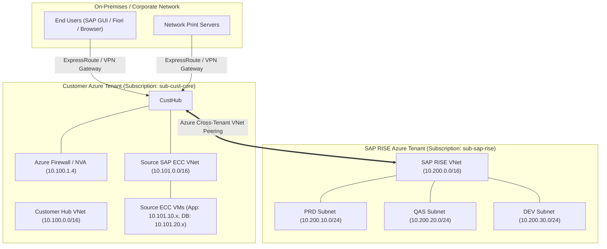
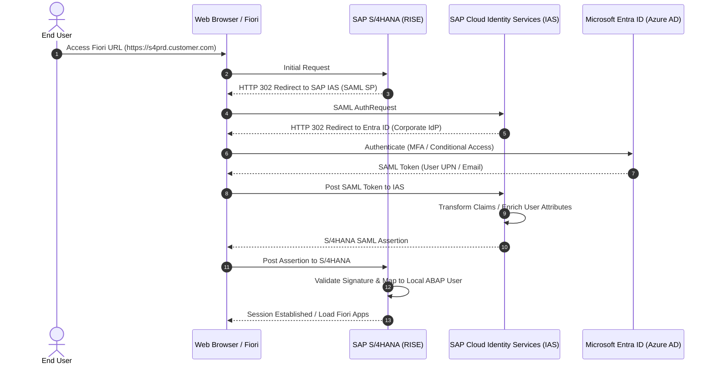

# Architecture, Network & Sizing Specification
## Cross-Tenant Azure IaaS to RISE with SAP Migration

This document specifies the network topology, data transfer pipe architecture, identity federation, and hardware sizing required to migrate an SAP ECC 6.0 instance on customer-managed Azure IaaS to RISE with SAP S/4HANA Cloud Private Edition (hosted on Microsoft Azure).

---

## 1. Network Topology & Hybrid Connectivity

Under RISE with SAP Cloud Private Edition, the SAP environment resides in an **SAP-owned Azure Subscription**. To maintain access to on-premises users and existing Azure workloads, the customer's Azure virtual network must peer directly with the SAP RISE virtual network.



### 1.1 IP Address Allocation & CIDR Strategy
* **Non-Overlapping RFC 1918 Address Space:**
  * During the SAP ECS onboarding questionnaire, the customer must define the CIDR block for RISE.
  * **Rule:** The RISE CIDR range must **never** overlap with any Customer Azure VNets, on-premises datacenters, or branch offices.
  * **Recommended Allocation:** `/16` block subdivided into dedicated subnets per tier (Sandbox, DEV, QAS, PRD) and management.
* **Sample IP Allocation Table:**

| Network Segment | CIDR Range | Description / Owner |
| :--- | :--- | :--- |
| **Customer Hub VNet** | `10.100.0.0/16` | Customer managed (ExpressRoute gateway, Azure Firewall) |
| **Source ECC VNet (Current)** | `10.101.0.0/16` | Customer managed (Current ECC 6.0 DB and App VMs) |
| **Target SAP RISE VNet** | `10.200.0.0/16` | SAP ECS managed (RISE environment) |
| ├── *RISE Sandbox Subnet* | `10.200.1.0/24` | SAP ECS (Sandbox HANA DB + PAS) |
| ├── *RISE DEV Subnet* | `10.200.10.0/24` | SAP ECS (Development HANA DB + PAS/AAS) |
| ├── *RISE QAS Subnet* | `10.200.20.0/24` | SAP ECS (Quality Assurance HANA DB + PAS/AAS) |
| └── *RISE PRD Subnet* | `10.200.30.0/24` | SAP ECS (Production HA HANA DB + PAS/AAS) |

### 1.2 Cross-Tenant Azure VNet Peering Setup
1. **Azure Active Directory Multi-Tenant Authorization:**
   * Customer creates a service principal or grants a guest invitation with `Network Contributor` role on the Customer Hub VNet to the SAP ECS Subscription.
   * SAP ECS configures the reciprocal peering from `sub-sap-rise` to `sub-cust-core`.
2. **Peering Attributes:**
   * `AllowVirtualNetworkAccess`: **Enabled** (Allows traffic flow between VNets).
   * `AllowForwardedTraffic`: **Enabled** (Allows traffic forwarded by NVA/Firewall).
   * `AllowGatewayTransit`: **Enabled on Customer Hub** (Allows SAP RISE to access On-Premises via Customer ExpressRoute).
   * `UseRemoteGateways`: **Enabled on SAP RISE VNet** (Permits RISE systems to reach On-Premises network transparently).

### 1.3 Firewall & Port Matrix
Ensure the following ports are opened in Customer Azure Network Security Groups (NSGs) and Azure Firewall:

| Source | Destination | Ports | Protocol | Purpose |
| :--- | :--- | :--- | :--- | :--- |
| End User Subnets | RISE PRD App/Web | `443` | TCP | HTTPS / Fiori Launchpad / WebGUI |
| End User Subnets | RISE PRD App | `3200-3299` | TCP | SAP GUI (SAP Dispatcher) |
| End User Subnets | RISE PRD App | `3600-3699` | TCP | SAP GUI Message Server |
| Developer Subnets | RISE DEV App | `3300-3399` | TCP | RFC Gateway / ABAP in Eclipse (ADT) |
| Source ECC VM | RISE Target VM | `4239` | TCP | SAP SUM DMO System Move Port |
| Source ECC VM | RISE Target VM | `22` / `445` | TCP | Rsync / SMB file transfer pipe |
| On-Prem Print Server | RISE App VMs | `515`, `631`, `9100` | TCP | Spool / Network Printing |
| RISE App VMs | Microsoft Entra ID | `443` | TCP | SAML 2.0 / OpenID Authentication |

---

## 2. High-Speed Data Migration Pipe (SUM DMO with System Move)

Because both source ECC and target RISE reside on Microsoft Azure's global optical backbone, cross-VNet data transfer achieves sustained throughput of **1.5 GB/s to 3.5 GB/s** when configured properly.

### 2.1 Transfer Architectures

```
Option 1: Memory Pipe Mode (Direct Network Streaming - Fastest, Lowest Disk Footprint)
Source Host (SUM)  ==== TCP Socket (Port 4239) over VNet Peering ====> Target Host (SUM)
(Reads Source DB -> Compresses -> Streams over Socket -> Decompresses -> HANA Import)

Option 2: Staged File Pipe (via Azure Storage / AzCopy / NFS Mount)
Source Host (SUM Export) ──► NFS / ANF Mount ──► AzCopy / rsync ──► Target Staging ──► Target SUM Import
```

### 2.2 Network & Performance Tuning Parameters
1. **Accelerated Networking:** Ensure `Accelerated Networking` (SR-IOV) is enabled on all source Azure VMs and requested for target RISE VMs. This drops VM-to-VM latency below 1.5 milliseconds and offloads packet processing from the CPU.
2. **Azure MTU:** Maximum Transmission Unit (MTU) is 1500 bytes on Azure virtual networks. Ensure no intermediary firewall drops packets due to MSS clamping.
3. **SUM Parameter File Optimization (`SUM/abap/bin/SAPup`):**
   * Increase parallel R3load processes based on available CPU cores:
     * `UPTIME R3load processes`: 8–16
     * `DOWNTIME R3load processes`: 32–64 (depending on target VM size)
   * Enable table splitting for tables exceeding 10 GB or 50 million rows (e.g., `BSIS`, `BSAS`, `BSAD`, `BKPF`).

---

## 3. Identity, Authentication & Single Sign-On (SSO)

Modern S/4HANA workflows rely on the **SAP Fiori Launchpad (HTTPS)** as the primary UI. Authentication is federated using Microsoft Entra ID (formerly Azure AD).



### 3.1 Architecture Components
* **Corporate Identity Provider (IdP):** Microsoft Entra ID manages corporate credentials, Conditional Access policies, and Multi-Factor Authentication (MFA).
* **Proxy / Federation Hub:** **SAP Cloud Identity Services - Identity Authentication (IAS)** acts as the central service provider to S/4HANA and proxies authentication to Entra ID.
* **Identity Provisioning (IPS):** Synchronizes user accounts and role assignments from Entra ID to SAP S/4HANA ABAP user master (`SU01`).

---

## 4. Hardware Sizing & SAP HANA on Azure Specs

### 4.1 Sizing Methodology
Sizing for S/4HANA is calculated using:
1. **SAP Readiness Check for S/4HANA:** Analyzes current database footprint, table compression ratios on HANA columnar store, and working memory requirements.
2. **SAP Quick Sizer Tool:** For new business processes or transaction volume growth.
3. **Memory Formula:**
   $$\text{Total HANA Memory Required} = (\text{Active Data in RAM}) + (\text{Dynamic Working Memory / Cache}) + (\text{Code \& OS Overhead})$$
   *Typical rule of thumb: S/4HANA requires memory roughly equal to $\approx 50\%$ of the uncompressed AnyDB footprint due to columnar compression, plus $20\%-30\%$ headroom.*

### 4.2 Target Azure VM Families for SAP RISE

| Environment | Typical Azure VM Size | vCPU | RAM (GiB) | Storage Configuration | HA / DR Configuration |
| :--- | :--- | :--- | :--- | :--- | :--- |
| **Sandbox** | `E32ds_v5` or `E64ds_v5` | 32–64 | 256–512 | Premium SSD v2 | Single VM (No HA) |
| **Development** | `E64ds_v5` or `M64ls` | 64 | 512–1,024 | Premium SSD v2 | Single VM (No HA) |
| **Quality (QAS)** | `M64s` or `M128s` | 64–128 | 1,024–2,048 | Premium SSD v2 / ANF | Single VM or HSR DR |
| **Production (PRD)** | `M128ms` or `M192ids_v2` | 128–192 | 3,840–4,000 | Azure NetApp Files (ANF) / Ultra Disk | Dual-Zone HA (HSR + Pacemaker) |

### 4.3 High Availability (HA) & Disaster Recovery (DR) in RISE
* **High Availability (Local Zone):**
  * SAP HANA System Replication (HSR) in **Synchronous mode** (`SYNCMEM`) across two Azure Availability Zones (e.g., Zone 1 and Zone 2).
  * Automated failover orchestrated by Linux Pacemaker Cluster (managed 100% by SAP ECS).
  * Target RTO: $< 30\text{ minutes}$, RPO: $0$.
* **Disaster Recovery (Secondary Region):**
  * Asynchronous HSR (`ASYNC`) to paired Azure Region (e.g., East US to West US).
  * Target RTO: $< 2\text{ hours}$, RPO: $< 15\text{ minutes}$.
