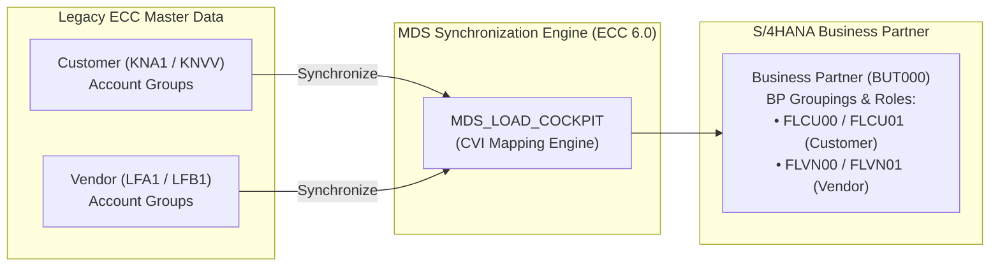

# Customer-Vendor Integration (CVI) Readiness Checklist
## Mandatory ECC 6.0 Pre-Conversion Deliverable for S/4HANA

In SAP S/4HANA, the **Business Partner (BP)** is the single master data entry point for managing customer and vendor data. Legacy transactions (`XD01`, `XD02`, `XK01`, `XK02`) are deprecated. 

Customer-Vendor Integration (**CVI**) must be fully configured, cleansed, and synchronized in your source **SAP ECC 6.0** environment before executing the technical conversion via SUM.

---

## 1. CVI Architecture & Number Range Strategy

### Number Assignment Strategies:
* **Strategy A: Same Number Assignment (Strongly Recommended):**
  * Customer/Vendor number in ECC equals the Business Partner number in S/4HANA (`Customer 10001` $\rightarrow$ `BP 10001`).
  * *Prerequisite:* The target BP Number Range must be set to **External**, and the numeric ranges must not overlap between Customers and Vendors.
* **Strategy B: Different Number Assignment:**
  * Used when Customer and Vendor numbering ranges overlap in legacy ECC (e.g., Customer `100` and Vendor `100` both exist for different legal entities).
  * System assigns a new internal BP number; original Customer/Vendor IDs are retained as secondary attributes.

---

## 2. Phase-by-Phase CVI Execution Checklist

### Phase 1: Pre-Analysis & Note Implementation
| Step | Action Item | Transaction / Tool | Status | Responsible |
| :---: | :--- | :--- | :---: | :--- |
| 1.1 | Implement master SAP CVI collective notes: `2265093`, `2344034`, `2399707`. | `SNOTE` | [ ] | Basis / ABAP |
| 1.2 | Launch the unified **CVI Cockpit** in ECC 6.0. | `CVI_COCKPIT` | [ ] | Functional Lead |
| 1.3 | Run the CVI Customizing Check to identify missing configurations. | `CVI_FS_CHECK_CUSTOMIZING` | [ ] | SD / MM Lead |
| 1.4 | Extract master data volume metrics (Active vs. Inactive/Flagged for Deletion). | `SE16N` (`KNA1`, `LFA1`) | [ ] | Master Data Team |

---

### Phase 2: Customizing & Synchronization Setup
| Step | Action Item | IMG Menu / Path | Status | Responsible |
| :---: | :--- | :--- | :---: | :--- |
| 2.1 | Define Business Partner Groupings (`Cross-Application Components -> SAP Business Partner -> Business Partner -> Basic Settings -> Number Ranges and Groupings`). | `BUCF` | [ ] | Functional Lead |
| 2.2 | Map Customer Account Groups to BP Groupings. | `SPRO` (`CVI -> Customer/Vendor Integration`) | [ ] | SD Lead |
| 2.3 | Map Vendor Account Groups to BP Groupings. | `SPRO` (`CVI -> Customer/Vendor Integration`) | [ ] | MM Lead |
| 2.4 | Configure Direction: `Customer -> Business Partner` (Set Same Number or Different Number). | `SPRO` | [ ] | SD Lead |
| 2.5 | Configure Direction: `Vendor -> Business Partner` (Set Same Number or Different Number). | `SPRO` | [ ] | MM Lead |
| 2.6 | Activate Post Processing Office (PPO) to capture synchronization errors. | `SPRO` | [ ] | Basis / Functional |

---

### Phase 3: Master Data Cleansing (In Source ECC 6.0)
| Step | Defect Area | Cleansing Action | Table / Fields | Status |
| :---: | :--- | :--- | :--- | :---: |
| 3.1 | **Tax Numbers (STCEG / STCD*)** | Validate VAT/Tax ID format against country-specific checksum algorithms. Invalid tax numbers cause hard sync aborts. | `KNA1-STCEG`, `LFA1-STCEG` | [ ] |
| 3.2 | **Postal Codes & Regions** | Validate postal code length and format against country table `T005`. | `KNA1-PSTLZ`, `LFA1-PSTLZ` | [ ] |
| 3.3 | **Bank Details & IBAN** | Verify Bank Keys, Account Numbers, and Swift codes. Run report `BUPA_BANK_CHECK`. | `KNBK`, `LFBK` | [ ] |
| 3.4 | **Contact Persons** | Check orphan contact persons (`KNVK`) missing mandatory relationship data or belonging to deleted customers. | `KNVK` | [ ] |
| 3.5 | **Duplicate Addresses** | Archive or flag unmaintained customers/vendors with deletion flag (`LOEVM = 'X'`). | `KNA1-LOEVM`, `LFA1-LOEVM` | [ ] |
| 3.6 | **Industry Codes & Email Addresses** | Ensure valid email formatting (must contain `@` and valid TLD); correct missing mandatory industry codes. | `ADR6-SMTP_ADDR` | [ ] |

---

### Phase 4: Synchronization Cockpit Execution
| Step | Action Item | Transaction / Program | Status | Responsible |
| :---: | :--- | :--- | :---: | :--- |
| 4.1 | Execute Synchronization Cockpit in **Test Run** mode. | `MDS_LOAD_COCKPIT` | [ ] | Master Data Lead |
| 4.2 | Analyze failed records in the Post Processing Office (PPO). | `/n/SAPPO/PPO2` | [ ] | Functional Team |
| 4.3 | Resolve business data errors in legacy records (`XD02`/`XK02`). | `XD02` / `XK02` | [ ] | Master Data Team |
| 4.4 | Execute Synchronization Cockpit in **Update Run** mode for Customers. | `MDS_LOAD_COCKPIT` | [ ] | Master Data Lead |
| 4.5 | Execute Synchronization Cockpit in **Update Run** mode for Vendors. | `MDS_LOAD_COCKPIT` | [ ] | Master Data Lead |
| 4.6 | Execute Synchronization Cockpit for Contact Persons (`KNVK`). | `MDS_LOAD_COCKPIT` | [ ] | Master Data Lead |

---

### Phase 5: Post-Synchronization Validation & Cutover Readiness
| Step | Action Item | Verification Method | Status | Responsible |
| :---: | :--- | :--- | :---: | :--- |
| 5.1 | Run CVI Validation Report: Ensure zero unresolved PPO errors remain. | `CVI_UPGRADE_CHECK_RESOLVE` | [ ] | Project Lead |
| 5.2 | Reconcile Record Counts: Total active Customers/Vendors in ECC vs. total Business Partners generated in table `BUT000`. | Table comparison (`KNA1` + `LFA1` vs. `BUT000`) | [ ] | Master Data Lead |
| 5.3 | Test bidirectional sync: Create a test Customer in `XD01`; verify automatic generation of corresponding BP in `BP`. | Functional smoke test | [ ] | SD / MM Leads |
| 5.4 | Sign off CVI milestone as complete for SAP SUM conversion prerequisites. | Milestone Sign-Off Document | [ ] | Project Director |

---

## 3. Top Common CVI Errors & Resolutions

| Error Code / Message | Root Cause | Solution |
| :--- | :--- | :--- |
| `Tax Number 1 is not valid for country XX` | Format or checksum validation failed in ECC master record. | Correct tax number via `XD02`/`XK02` or disable strict tax check via note `2403248` temporarily during sync. |
| `Postal code must have length X` | Postal code violates country checks configured in table `T005`. | Adjust the postal code in customer record or update configuration in `OY01`/`OY17`. |
| `Grouping XXXX does not exist for BP` | Account Group to BP Grouping mapping missing in CVI customizing. | Configure missing entry in `SPRO` (`CVI -> Master Data Synchronization -> Customer/Vendor Integration`). |
| `Customer XXXX already assigned to BP YYYY` | Record was partially synchronized in a previous incomplete run. | Reset sync status using report `CVI_MIGRATION_PREF_RESET` and re-run synchronization cockpit. |
| `Bank account number has invalid characters` | Non-numeric or whitespace characters present in bank account field. | Clean bank master data in table `KNBK` / `LFBK`. |
