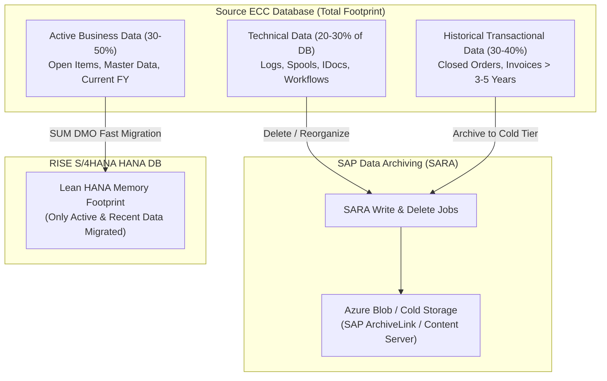

# Data Cleansing & Archiving Specification
## Downtime Optimization & HANA Sizing Reduction

Archiving and data cleansing prior to migrating from Azure IaaS to RISE with SAP S/4HANA achieves three primary objectives:
1. **Reduces SAP HANA Sizing:** Lowers RAM and Azure VM sizing requirements, directly reducing RISE subscription and cloud infrastructure costs.
2. **Shortens Cutover Downtime:** Every gigabyte of historical data archived reduces SUM DMO export, network transfer over Azure VNet Peering, and HANA import duration by **30% to 50%**.
3. **Ensures Migration Data Integrity:** Cleans up corrupted legacy transactional records that would otherwise fail during S/4HANA Universal Journal conversion.

---

## 1. Top Archiving Candidates & SARA Objects

### 1.1 Technical Data Housekeeping (High Yield / Zero Business Impact)

| Data Category | Target Tables | Recommended Clean-Up Tool / Program | Typical Savings |
| :--- | :--- | :--- | :---: |
| **Application Logs** | `BALDAT`, `BALHDR` | Program `SBAL_DELETE` (Delete logs older than 90–180 days). | **10–50 GB** |
| **Spool Requests** | `TST01`, `TST03`, `TSP01` | Program `RSPO0041` (Reorganize spool older than 14 days). | **20–100 GB** |
| **IDoc Data** | `EDIDC`, `EDID4`, `EDIDS` | Program `RSEXARCA` / SARA Object `IDOC` (Archive completed IDocs). | **30–200 GB** |
| **Batch Job Logs** | `TBTCO`, `TBTCP`, `TBTCG` | Program `RSBTCDEL2` (Purge batch job history older than 30 days). | **10–40 GB** |
| **Workflow History** | `SWWWIHEAD`, `SWWLOGHIST` | SARA Object `WORKITEM` / Program `RSWWHIS1` (Archive completed workflows). | **15–60 GB** |
| **DB Table Statistics / Traces** | `MONI`, `OSMON`, `PAHI` | Programs `SAP_COLLECTOR_FOR_PERFMONITOR` and `RSSTAT30`. | **5–20 GB** |

---

### 1.2 Business Transactional Archiving (SARA)

| Business Module | SARA Object | Target Tables | Recommended Retention Period |
| :--- | :--- | :--- | :---: |
| **Financial Accounting (FI)** | `FI_DOCUMNT` | `BKPF`, `BSEG`, `BSIS`, `BSAS` | Closed fiscal years $> 3\text{ to }7\text{ years}$. |
| **Sales & Distribution (SD)** | `SD_VBAK`, `SD_VFDL` | `VBAK`, `VBAP`, `VBRK`, `VBRP` | Completed orders & billing docs $> 2\text{ to }3\text{ years}$. |
| **Materials Management (MM)**| `MM_EKKO`, `MM_MATBEL` | `EKKO`, `EKPO`, `MKPF`, `MSEG` | Closed POs & material movement docs $> 2\text{ to }3\text{ years}$. |
| **Controlling (CO)** | `CO_ITEM` | `COEP`, `COEJ` | Closed line items $> 2\text{ to }3\text{ years}$. |

---

## 2. S/4HANA Pre-Conversion Functional Cleansing

In addition to data volume reduction, specific transactional data must be reconciled and cleaned to prevent hard aborts during S/4HANA financial data conversion (`FINS_MIG_STATUS`):

### 2.1 General Ledger & Open Item Cleansing
1. **Clear Open Items:**
   * Run automatic clearing (`F.13`) for open items in customer, vendor, and general ledger accounts.
   * Clear historical items in GR/IR clearing account (`WRX` transaction) using transaction `MR11`.
2. **Execute Year-End Balance Carryforward:**
   * Ensure balance carryforward (`FAGLGVTR`) was executed for all past completed fiscal years.
3. **Execute Period-End Closing Activities:**
   * Close all previous accounting periods in `OB52` and Controlling periods in `OKP1`.
   * Only the current cutover period must remain open.

### 2.2 Asset Accounting Pre-Checks
1. **Depreciation Postings (`AFAB`):**
   * Depreciation must be fully posted up to the period immediately preceding the cutover date.
2. **Year-End Closing for Asset Accounting (`AJAB`):**
   * Close all previous fiscal years in Asset Accounting. S/4HANA allows a maximum of two open fiscal years.
3. **Check for Incomplete Assets:**
   * Run report `RACHECK01` and `RAIKPS01` to identify incomplete asset master records or missing depreciation areas.

### 2.3 Material Ledger Consistency Check
1. S/4HANA mandates the activation of the **Material Ledger (ML)**.
2. Run report `CKMLMV_MIG_CHECK` in the source ECC system to identify price determination errors, valuation conflicts, or currencies missing from material master records.

---

## 3. Pre-Migration Data Cleansing Execution Timeline

| Milestone | Window | Key Tasks & Deliverables | Owner |
| :--- | :---: | :--- | :--- |
| **Initial Assessment** | T-90 Days | Run table analysis (`DB02`) to identify top 20 largest tables. Finalize archiving scope. | Basis & DBA |
| **Technical Cleanup** | T-60 Days | Execute `RSPO0041`, `SBAL_DELETE`, `RSBTCDEL2`, and IDoc reorganization. | Basis Lead |
| **Archiving Wave 1** | T-45 Days | Execute SARA archiving for Sales and Purchase orders older than agreed retention rules. | Functional Leads |
| **Archiving Wave 2** | T-30 Days | Execute SARA archiving for FI documents. Update table statistics. | Finance Lead |
| **Functional Cleansing** | T-14 Days | Clear open items (`F.13`), GR/IR cleanup (`MR11`), verify depreciation runs (`AFAB`). | Finance & MM Leads |
| **Final Freeze & Sizing Sign-off** | T-7 Days | Re-run SAP Readiness Check sizing analysis with final cleansed DB volume. Confirm RISE HANA RAM tier. | Project Manager |
