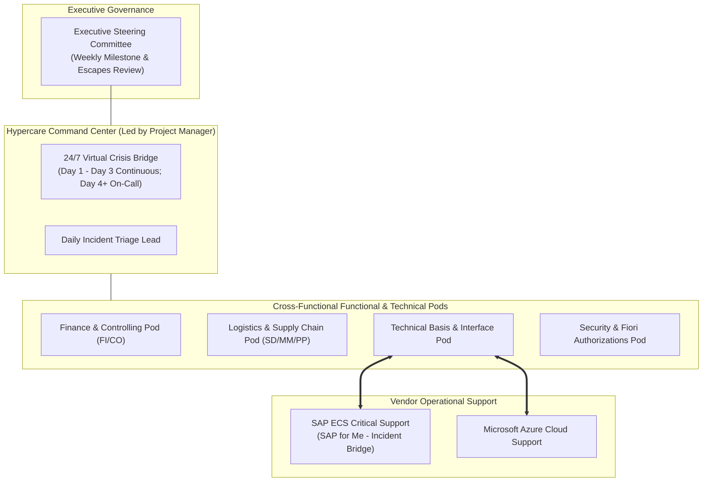

# Post-Migration Stabilization & Hypercare Operational Guide
## S/4HANA Cloud Private Edition in RISE with SAP

This guide provides the operational procedures, technical stabilization tasks, and hypercare governance framework required immediately following the production cutover from Azure IaaS to **RISE with SAP S/4HANA Cloud Private Edition**.

---

## 1. Post-Migration Stabilization Phases

Stabilization is executed across three sequential horizons:

```
┌────────────────────────────┐    ┌────────────────────────────┐    ┌────────────────────────────┐
│    Day 1 - Day 3 (72h)     │    │     Day 4 - Day 14         │    │      Day 15 - Day 30       │
│  Immediate Technical &     │───►│  Operational Stabilization │───►│ Hypercare Exit & Steady    │
│  Business Validation       │    │  & First Month-End Close   │    │ State Handover to SAP ECS  │
└────────────────────────────┘    └────────────────────────────┘    └────────────────────────────┘
```

---

## 2. Immediate Technical Post-Migration Steps (Day 1 - Day 3)

### 2.1 Security & Role Remediation (`SU25`)
Because S/4HANA introduces new authorization objects, transactions, and CDS-based authorization checks, authorization roles must be updated.

| Step | Action Item | Transaction | Details / Procedure | Owner |
| :---: | :--- | :---: | :--- | :--- |
| **1** | Run Step 2a | `SU25` | Compare newly delivered authorization default values against customer values. | Security Lead |
| **2** | Run Step 2b | `SU25` | Compare customer tables against SAP default tables. | Security Lead |
| **3** | Run Step 2c | `SU25` | Identify affected roles in `PFCG` (roles containing obsolete transactions like `XK01`, `FK01`, `XD01`, `MB01`). | Security Lead |
| **4** | Role Generation | `PFCG` | Remediate transactions with their S/4HANA equivalents (`BP`, `MIGO`, etc.) and regenerate role profiles. | Security Team |
| **5** | Fiori Catalogs | `/UI2/FLPD_CUST` | Assign business catalogs and spaces/pages to end-user composite roles. | Fiori / Security |

---

### 2.2 Background Job & Batch Architecture Stabilization
1. **Unfreeze Batch Scheduling:**
   * Run program `BTCTRNS2` to resume job scheduling that was suspended prior to cutover.
2. **Review Obsolete / Deprecated Batch Jobs:**
   * Disable legacy ECC-specific batch jobs that are superseded in S/4HANA:
     * `SAPF124` / `SAPF124E` (Automatic clearing – evaluate S/4HANA rule-based clearing).
     * `RMBABEG*` (Obsolete logistics batch runs replaced by real-time inventory).
     * Old financial reporting extractors.
3. **Verify Critical Batch Windows:**
   * Confirm schedule, variants, and execution servers for:
     * **MRP Live** (`PP_MRP_DISPATCH` or transaction `MD01N`).
     * **Billing Creation Runs** (`SDBILLDL`).
     * **Payment Program** (`F110` / `F111`).
     * **Inventory Valuation** runs.

---

### 2.3 Interface & Connectivity Health Check
1. **RFC Destinations (`SM59`):**
   * Execute connection tests and authorization tests on all Type 3 (ABAP) and Type T (TCP/IP) RFC destinations.
   * Verify response times over Azure VNet Peering are $< 5\text{ ms}$.
2. **Web Services & SOAP (`SOAMANAGER`):**
   * Verify all active endpoints and confirm SSL certificates are trusted in `STRUST`.
3. **Queue Health Check:**
   * Inspect transactional queues (`SMQ1`, `SMQ2`, `SM58`) every 2 hours during Day 1 to confirm zero stuck queues (`SYSFAIL`, `RETRY`).
4. **Network Printing & Spool (`SPAD`):**
   * Send test print requests from each plant, warehouse, and office location.
   * Validate routing through the Customer Azure Hub to on-premises print servers.

---

### 2.4 SAP HANA Database & Infrastructure Baseline
Coordinate with **SAP Enterprise Cloud Services (ECS)** to review:

1. **Post-Go-Live Database Backup:**
   * Request SAP ECS trigger an **Ad-Hoc Full HANA DB Backup** within 12 hours of production go-live.
2. **HANA High Availability (HSR) Synchronization:**
   * Confirm HANA System Replication to the secondary Azure Availability Zone is in active `SYNC` status via SAP HANA Studio / Cockpit.
3. **Expensive Statement Trace:**
   * Review statements consuming $> 5\%$ CPU or causing high memory spikes.
   * Schedule automatic table statistics updates via `DB13`.

---

## 3. Financial & Business Reconciliation (Day 1 - Day 7)

### 3.1 Daily Financial Reconciliation Matrix
Run these comparison reports daily at 07:00 and 19:00 against the cutover baseline:

| Financial Domain | Transaction Code | Validation Target | Acceptable Variance |
| :--- | :---: | :--- | :---: |
| **General Ledger Balance** | `FAGLB03` / `RFBILA00` | Compare total assets, liabilities, and P&L balances. | **$0.00** |
| **Customer Subledger vs. G/L** | `S_ALR_87012172` | Balance of subledger (`KNB1`) matches reconciliation account. | **$0.00** |
| **Vendor Subledger vs. G/L** | `S_ALR_87012082` | Balance of subledger (`LFB1`) matches reconciliation account. | **$0.00** |
| **Asset Accounting vs. G/L** | `ABST2` | Reconcile Asset Subledger (`ANLC`) with General Ledger (`ACDOCA`). | **$0.00** |
| **Material Ledger vs. G/L** | `CKMLPO` / `MB5L` | Inventory stock value matches balance sheet stock account. | **$0.00** |

### 3.2 Core Business Transaction Health Checks
* **Order-to-Cash (O2C):** Monitor daily document flow: Sales Orders (`VA05`) $\rightarrow$ Deliveries (`VL06O`) $\rightarrow$ Invoices (`VF04`/`VF05N`) $\rightarrow$ Accounting Postings (`FB03`).
* **Procure-to-Pay (P2P):** Monitor Purchase Orders (`ME2N`), Goods Receipts (`MB51`/`MIGO`), and Invoice Receipts (`MIR6`/`MIRO`).
* **Cash Management:** Verify bank statement imports (`FEBAN` / `CAMT.053` / `MT940`) and lockbox processing.

---

## 4. Hypercare Governance Framework (Weeks 1 to 4)

### 4.1 Hypercare Organization Structure



### 4.2 Support Shift Schedule (First 72 Hours)
* **Shift A (Day):** 07:00 – 16:00 (On-site / Primary Business Hours)
* **Shift B (Evening):** 15:30 – 00:30 (Evening Processing / Batch Monitoring)
* **Shift C (Night):** 00:00 – 07:30 (Batch Window / Global Operations / Interface Monitoring)
* *30-minute handover overlap between every shift.*

---

## 5. Incident Management & Escalation Protocols

### 5.1 Severity Definitions & Target Resolution SLAs

| Priority | Criteria | Response Time | Target Workaround / Fix |
| :--- | :--- | :---: | :---: |
| **P1 - Critical (Very High)** | Complete production outage; critical business process stopped (cannot invoice, cannot ship goods, core interface down). | **$< 15\text{ mins}$** | **$< 4\text{ hours}$** |
| **P2 - Major (High)** | Severe business degradation; workaround available but time-critical; key batch job failing. | **$< 30\text{ mins}$** | **$< 8\text{ hours}$** |
| **P3 - Moderate (Medium)** | Individual user impacted; standard functionality error; non-critical interface error. | **$< 2\text{ hours}$** | **$< 24\text{ hours}$** |
| **P4 - Minor (Low)** | Cosmetic UI issue; general inquiry; minor documentation update. | **$< 4\text{ hours}$** | **$< 5\text{ days}$** |

### 5.2 SAP Enterprise Cloud Services (ECS) Escalation Path
For incidents involving core infrastructure, OS, or HANA database in the RISE subscription:

```
Step 1: Open Ticket in SAP for Me (Priority: Very High / High)
        Component: XX-HST-OPR-* (SAP Cloud Infrastructure & Basis)
        ▼
Step 2: If no response within 15 minutes for P1, trigger SAP Hot-Line Call
        Telephone: Regional SAP Support Hotline (quote Ticket # and S-User)
        ▼
Step 3: Notify SAP Dedicated Client Delivery Manager (CDM)
        Direct mobile escalation to assigned SAP RISE Engagement Director
        ▼
Step 4: Request immediate bridge with SAP Mission Control Center (MCC)
```

---

## 6. Daily Hypercare Cadence & Dashboard

### 6.1 Daily Meeting Rhythm
1. **08:30 – 09:00 (Morning Standup):**
   * Review overnight batch job status.
   * Review interface queue volumes and any failed transactions.
   * Prioritize P1/P2 tickets for the day.
2. **14:00 – 14:30 (Mid-Day Checkpoint):**
   * Review high-priority ticket progress.
   * Review warehouse shipping and order processing throughput.
3. **17:30 – 18:00 (Evening Wrap-Up & Handover):**
   * Review daily incident burn-down metrics.
   * Approve urgent emergency transports (`TR`) for evening release.
   * Formal handover to night shift team.

### 6.2 Key Operational Metrics (KPIs) to Track
* **Incident Metrics:** Active vs. Closed tickets by module (FI, SD, MM, Basis, Security).
* **System Health:** CPU utilization ($< 65\%$), HANA RAM usage ($< 80\%$), Average Dialog Response Time ($< 800\text{ ms}$).
* **Interface Health:** IDocs in status `51` (Error) or `03` (Sent but unconfirmed).
* **Business Volumes:** Total Sales Orders posted vs. Historical Average ($\pm 5\%$).

---

## 7. Hypercare Exit Criteria & Handover to BAU

At the conclusion of Week 4 (or post Month-End Close), the project steering committee evaluates the following exit criteria:

### 7.1 Mandatory Exit Gates
- [ ] **1. Zero P1 (Critical) and Zero P2 (Major) Open Incidents** for 5 consecutive business days.
- [ ] **2. First S/4HANA Month-End Close (MEC) Successfully Completed** with signed financial statements.
- [ ] **3. Daily Batch Job Success Rate $> 99.5\%$** over the preceding 7 days.
- [ ] **4. Core Interface Queue Failure Rate $< 0.1\%$**.
- [ ] **5. All Emergency Transports Documented & Retrofitted** into development landscape.
- [ ] **6. User Security Authorizations Stabilized** ($< 5$ authorization tickets per day).
- [ ] **7. Formal Operational Handover Document Signed** between Implementation Partner, Internal IT Operations, and SAP ECS.

---

## 8. Source Azure ECC Decommissioning Plan

Once the Hypercare Exit Gate is approved (typically T+30 to T+45 days):

1. **T+30 Days (Source Isolation):**
   * Stop source ECC VMs on Azure IaaS (`stopsap` and stop Azure VMs in Azure Portal).
   * Sever VNet Peering routes pointing to the legacy ECC subnet.
2. **T+45 Days (Final Archival Backup):**
   * Create an Azure Snapshot / cold backup of source VM OS and DB disks.
   * Store disk snapshots in Azure Archive Storage (retention period: 3 to 7 years per regulatory tax compliance).
3. **T+60 Days (Asset Decommissioning):**
   * Delete Azure Virtual Machines, Network Interfaces, and high-performance managed disks.
   * Release reserved IP addresses.
   * Confirm monthly Azure IaaS invoice reflects decommissioned resource cost savings.
