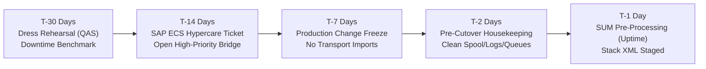

# Technical Cutover Runbook
## Production Conversion from Azure IaaS to RISE with SAP S/4HANA Private Edition

This runbook provides an operational, minute-by-minute execution plan for the Production Cutover Weekend. It assumes a Brownfield System Conversion executed via **SAP Software Update Manager (SUM) with Database Migration Option (DMO) - System Move** across peered Azure Virtual Networks.

---

## 1. Cutover Overview & Key Parameters

* **Source System:** SAP ECC 6.0 PRD (Customer Azure VNet, `10.101.0.0/16`)
* **Target System:** SAP S/4HANA Cloud Private Edition PRD (SAP RISE VNet, `10.200.0.0/16`)
* **Data Migration Path:** Cross-Tenant Azure VNet Peering (High-Speed Memory Pipe / Direct Network Streaming)
* **Total Allotted Downtime Window:** **60 Hours** (Friday 18:00 to Monday 06:00)
* **Point of No Return (PONR):** Sunday 18:00 (Go / No-Go Decision Gate)

---

## 2. Pre-Cutover Milestones (T-30 Days to T-1 Day)

| Timeline | Phase | Action Item | Transaction / Command | Owner |
| :--- | :--- | :--- | :--- | :--- |
| **T-30 Days** | Dry Run | Execute complete Mock Cutover on a fresh copy of PRD in QAS. Benchmark network transfer rate across Azure VNet. | SUM DMO | SI Basis Lead |
| **T-21 Days** | Housekeeping | Archive old data (IDocs, application logs `BALDAT`, spool tables `TST01`/`TST03`, batch job logs). | `SARA`, `SP01` | Customer Basis |
| **T-14 Days** | SAP ECS | Submit **Critical Event / Cutover Support Request** in SAP for Me. Confirm 24/7 dedicated ECS on-call engineers. | SAP for Me | Project Manager |
| **T-7 Days** | Governance | Institute strict **Production Change Freeze**. Lock transport imports (`STMS`) in ECC PRD. | `STMS` | Change Advisory Board |
| **T-3 Days** | Target Check | Verify target RISE HANA DB, PAS, and AAS instances are healthy, patched, and accessible over VNet Peering. | `HDB Studio` / SSH | SAP ECS / SI Basis |
| **T-1 Day** | Uptime SUM | Start SUM DMO on source ECC host in **Uptime Mode**. Run initial data consistency checks and table split definitions. | `SUM/abap/bin/SAPup` | SI Basis Lead |

---

## 3. Hour-by-Hour Cutover Weekend Execution Schedule

### Phase 1: Business Ramp-Down & Source System Freeze (Friday 18:00 – 22:00)
**Window Duration:** 4 Hours | **Cumulative Time:** T+0 to T+4

| Target Time | Step # | Task Description | Tool / Transaction | Owner | Sign-Off |
| :---: | :---: | :--- | :--- | :--- | :---: |
| **18:00** | 1.1 | **Cutover Kick-Off:** Open 24/7 Command Center Virtual Bridge. Announce start of production downtime. | MS Teams / Slack | Project Mgr | [ ] |
| **18:15** | 1.2 | Suspend all scheduled background jobs in source ECC. | Program `BTCTRNS1` | Customer Basis | [ ] |
| **18:30** | 1.3 | Lock all dialog users except technical cutover administrators (`DDIC`, `SAP*`, Basis admins). | `SU10` | Security Lead | [ ] |
| **18:45** | 1.4 | Clear and drain transactional queues. Ensure no unprocessed inbound/outbound queues remain. | `SMQ1`, `SMQ2`, `SM58` | Basis Lead | [ ] |
| **19:15** | 1.5 | Stop external inbound interfaces (RFC, EDI, PI/PO, File adapters, API Gateway). | Azure Firewall / SM59 | Integration Lead| [ ] |
| **19:45** | 1.6 | **Extract Pre-Migration Financial Baselines:** Run Trial Balance, Customer/Vendor Balances, and Asset Balances. Export reports to local secure repository. | `RFBILA00`, `S_ALR_87012082`, `RAHAUQ00` | Finance Lead | [ ] |
| **20:45** | 1.7 | Confirm CVI synchronization status: Verify zero records remain in Post Processing Office. | `/n/SAPPO/PPO2` | Master Data Lead| [ ] |
| **21:00** | 1.8 | **Full Database Baseline Backup:** Execute full database backup of source ECC system on Azure IaaS (Cold/Warm Snapshot). | Azure Backup / Native DB | Customer DBA | [ ] |
| **21:45** | 1.9 | **Gate 1 Sign-Off:** Baseline verified; system ready for technical downtime handover. | Checklist Review | Project Director| [ ] |

---

### Phase 2: SUM DMO System Move Execution (Friday 22:00 – Saturday 18:00)
**Window Duration:** 20 Hours | **Cumulative Time:** T+4 to T+24

| Target Time | Step # | Task Description | Tool / Transaction | Owner | Sign-Off |
| :---: | :---: | :--- | :--- | :--- | :---: |
| **22:00** | 2.1 | Stop ECC application instances. Leave primary database online for SUM access. | `stopsap` | SI Basis Lead | [ ] |
| **22:15** | 2.2 | In SUM GUI, confirm entry into the **Downtime Phase** (`MOD_SELROAD/RUN_FDIC_DOWNTIME`). | SUM Browser Interface | SI Basis Lead | [ ] |
| **23:00** | 2.3 | **Delta Data Export:** SUM exports remaining transactional data and delta tables from source DB. | R3load / R3ldctl | SI Basis Lead | [ ] |
| **Saturday 01:00** | 2.4 | **Cross-VNet Data Transfer:** High-speed streaming of data blocks across Azure VNet Peering to target RISE HANA instance. | SUM Socket / AzCopy | SI Basis Lead | [ ] |
| **04:00** | 2.5 | Monitor transfer speed and network saturation (Ensure $> 1.5\text{ GB/s}$ sustained throughput). | Azure Network Monitor | Azure Cloud Eng | [ ] |
| **08:00** | 2.6 | Target HANA Database Import: Parallel `R3load` processes write data into target SAP HANA columnar store. | Target SUM Monitor | SI Basis Lead | [ ] |
| **13:00** | 2.7 | Execute Database Consistency Checks on target HANA instance in RISE. | Target SUM / HDB | SI Basis Lead | [ ] |
| **15:00** | 2.8 | S/4HANA Software Conversion & Data Structure Transformation (Generation of views, Universal Journal table `ACDOCA` foundation). | SUM Module `EU_IMPORT` | SI Basis Lead | [ ] |
| **17:00** | 2.9 | Execution of After-Import Execution Scripts (`XPRAS`). | SUM Phase `RUN_XPRAS` | SI Basis Lead | [ ] |
| **18:00** | 2.10 | **Gate 2 Sign-Off:** SUM DMO System Move completes successfully. Target system handed over to Application team. | SUM Completion Log | SI Basis Lead | [ ] |

---

### Phase 3: S/4HANA Data & Financial Migration (Saturday 18:00 – Sunday 04:00)
**Window Duration:** 10 Hours | **Cumulative Time:** T+24 to T+34

| Target Time | Step # | Task Description | Tool / Transaction | Owner | Sign-Off |
| :---: | :---: | :--- | :--- | :--- | :---: |
| **18:00** | 3.1 | Start target S/4HANA instance in RISE environment (`startsap`). | Target Host Shell | SI Basis Lead | [ ] |
| **18:30** | 3.2 | Launch **S/4HANA Migration Cockpit for Financials** (`FINS_MIG_STATUS`). | `FINS_MIG_STATUS` | Finance Lead | [ ] |
| **19:00** | 3.3 | Execute Preparation & Data Integrity checks for General Ledger and Controlling. | `FINS_MIG_PRE_CHECK` | Finance Lead | [ ] |
| **21:00** | 3.4 | Execute Material Ledger (ML) migration: Convert inventory balances to S/4HANA standard. | Transaction `CKML_MIG` | CO / MM Lead | [ ] |
| **23:00** | 3.5 | Execute Universal Journal Migration: Synthesize legacy tables (`BSIS`, `BSAS`, `BKPF`, `COEP`) into `ACDOCA`. | `FINS_MIG_UJ` | Finance Lead | [ ] |
| **Sunday 01:30** | 3.6 | Execute Asset Accounting Migration (`FAA_MIG`). Verify depreciation areas and balances. | `FAA_MIG` | Asset Acct Lead | [ ] |
| **03:00** | 3.7 | Run Balance Carryforward in S/4HANA (`FAGLGVTR`). | `FAGLGVTR` | Finance Lead | [ ] |
| **04:00** | 3.8 | **Gate 3 Sign-Off:** Financial migration reconciles with zero fatal errors. | Status Cockpit | Finance Director| [ ] |

---

### Phase 4: Technical Post-Processing & Integration Re-Pointing (Sunday 04:00 – 12:00)
**Window Duration:** 8 Hours | **Cumulative Time:** T+34 to T+42

| Target Time | Step # | Task Description | Tool / Transaction | Owner | Sign-Off |
| :---: | :---: | :--- | :--- | :--- | :---: |
| **04:00** | 4.1 | Execute full ABAP compilation (`SGEN`) on target S/4HANA instance to eliminate runtime compilation delays. | `SGEN` (Parallel jobs) | SI Basis Lead | [ ] |
| **07:00** | 4.2 | Re-point RFC destinations (`SM59`), Logical Ports (`SOAMANAGER`), and Web Services to target endpoints. | `SM59`, `SOAMANAGER` | Integration Lead| [ ] |
| **08:30** | 4.3 | Update Spool & Network Printer IP configurations in `SPAD` to reflect new routing via VNet Peering. | `SPAD` | Customer Basis | [ ] |
| **09:30** | 4.4 | Configure and activate Microsoft Entra ID SSO via SAP Cloud Identity Services (IAS). | `SAML2` / Azure Portal | Security Lead | [ ] |
| **10:30** | 4.5 | Validate Fiori Launchpad services (`/UI2/FLP`) and activate mandatory OData services via `task_list`. | `/IWFND/MAINT_SERVICE` | Fiori Lead | [ ] |
| **11:30** | 4.6 | Request SAP ECS to trigger an **Ad-Hoc Full HANA DB Backup** in the RISE environment. | SAP for Me Ticket | SAP ECS | [ ] |
| **12:00** | 4.7 | **Gate 4 Sign-Off:** Technical configuration complete. System ready for Business Validation. | Checklist Review | SI Basis Lead | [ ] |

---

### Phase 5: Business Smoke Testing & Validation (Sunday 12:00 – 18:00)
**Window Duration:** 6 Hours | **Cumulative Time:** T+42 to T+48

| Target Time | Step # | Task Description | Test Scope | Owner | Sign-Off |
| :---: | :---: | :--- | :--- | :--- | :---: |
| **12:00** | 5.1 | **Financial Reconciliation:** Re-run Trial Balance and Financial Statements in S/4HANA. Compare against Friday baseline extracts ($100\%$ match required). | `FAGLB03`, `RFBILA00` | Finance Lead | [ ] |
| **13:30** | 5.2 | **Order-to-Cash (O2C) Smoke Test:** Create test sales order, delivery, billing document, and accounting posting. Verify print output. | `VA01`, `VL01N`, `VF01` | SD Business Owner| [ ] |
| **15:00** | 5.3 | **Procure-to-Pay (P2P) Smoke Test:** Create test purchase requisition, purchase order, goods receipt (`MIGO`), and invoice verification (`MIRO`). | `ME21N`, `MIGO`, `MIRO` | MM Business Owner| [ ] |
| **16:30** | 5.4 | **Interface Sanity Tests:** Send test inbound/outbound IDoc messages; test banking/payment interfaces. | `WE02`, `BD87` | Integration Lead| [ ] |
| **17:30** | 5.5 | Compile Business Validation Scorecard for Executive Steering Committee. | Validation Matrix | Project Manager | [ ] |

---

### Phase 6: Go / No-Go Decision Gate (Sunday 18:00)
**Point of No Return (PONR)**

> [!CAUTION]
> Once the decision to **GO** is confirmed and users are unlocked in S/4HANA, the system becomes the official system of record. Rollback is only permitted prior to this gate.

#### Go / No-Go Criteria Checklist:
* [ ] 1. SUM DMO technical conversion completed without data loss.
* [ ] 2. Financial reconciliation signed off by Finance Director (Trial balance variance = $0).
* [ ] 3. All core business smoke tests passed (O2C, P2P, Finance, Inventory).
* [ ] 4. All critical interfaces operational and connected.
* [ ] 5. SAP ECS confirms primary and secondary HA nodes are healthy and synchronized.
* [ ] 6. Microsoft Entra ID SSO fully operational.

**Decision Recorded:** [ ] **GO** &nbsp;&nbsp;&nbsp;&nbsp; [ ] **NO-GO (Execute Rollback)**  
**Executive Sponsor Sign-Off:** ___________________________ &nbsp;&nbsp;&nbsp;&nbsp; **Timestamp:** ____________

---

### Phase 7: Production Release & Cutover Completion (Sunday 18:30 – 22:00)
**Window Duration:** 3.5 Hours | **Cumulative Time:** T+48.5 to T+52

| Target Time | Step # | Task Description | Tool / Transaction | Owner | Sign-Off |
| :---: | :---: | :--- | :--- | :--- | :---: |
| **18:30** | 7.1 | Delete or reverse all test documents created during Phase 5 validation. | `FB08`, `VF11`, etc. | Business Teams | [ ] |
| **19:15** | 7.2 | Update corporate DNS records: Point `sap.company.com` and Fiori aliases to RISE Azure Application Gateway. | Azure DNS / InfoBlox | Network Lead | [ ] |
| **20:00** | 7.3 | Release scheduled background jobs in S/4HANA. | Program `BTCTRNS2` | Customer Basis | [ ] |
| **20:45** | 7.4 | Unlock all business users in S/4HANA. | `SU10` | Security Lead | [ ] |
| **21:30** | 7.5 | Send official Go-Live broadcast email to enterprise user community. | Email Announcement | Change Lead | [ ] |
| **22:00** | 7.6 | **System Ready for Business Operation.** | Command Center | Project Director| [ ] |

---

### Phase 8: Day 1 Hypercare & Operations Handover (Monday 06:00+)

* **Command Center Shift Schedule:** 24/7 coverage for the first 72 hours post go-live (Basis, Functional, Security, ABAP).
* **High-Priority Escalation Channel:** Dedicated bridge linked to SAP ECS Critical Incident management.
* **Decommissioning Milestone:** After 30 days of successful production operation, decommission source Azure ECC VMs according to data retention policies.

---

## 4. Rollback & Contingency Plan (In the Event of a NO-GO)

If unresolvable technical blockers occur prior to the Sunday 18:00 gate:

1. **Trigger Condition:** Irreparable data corruption during Universal Journal conversion, total network failure between Azure tenants exceeding 6 hours, or severe financial reconciliation discrepancy.
2. **Rollback Steps:**
   * Step 1: Formal declaration of NO-GO by Steering Committee.
   * Step 2: Shutdown target S/4HANA instances in RISE (`stopsap`).
   * Step 3: Power on / start source SAP ECC 6.0 system on Azure IaaS (`startsap`). If the source DB was modified by SUM, restore the cold baseline snapshot taken on Friday at 21:00.
   * Step 4: Re-enable batch jobs (`BTCTRNS2`) on source ECC.
   * Step 5: Unlock users (`SU10`) on source ECC.
   * Step 6: Rollback DNS changes and re-enable source interfaces.
   * Step 7: Issue business notification that production operations remain on ECC 6.0.
