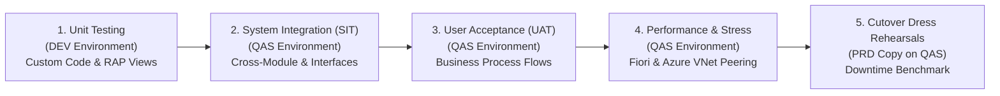

# Testing Strategy & Business Test Catalog
## Quality Assurance Framework for S/4HANA Private Edition Migration

A rigorous, multi-tiered testing strategy is essential to ensure business continuity, performance SLA compliance, and zero data loss when converting from Azure IaaS to **RISE with SAP S/4HANA Cloud Private Edition**.

---

## 1. Multi-Tier Testing Lifecycle

### Test Phases & Environment Matrix:

| Test Phase | Environment | Objective | Scope |
| :--- | :---: | :--- | :--- |
| **Unit Testing** | **DEV (RISE)** | Validate remediated custom ABAP code and newly configured S/4HANA delta functions. | Technical ATC checks, individual reports, CDS views, custom BAPIs. |
| **SIT 1 & SIT 2** | **QAS (RISE)** | Validate end-to-end process integration, third-party interfaces, and batch jobs. | All core business flows, RFC/SOAP interfaces, printing, external EDI. |
| **User Acceptance (UAT)** | **QAS (RISE)** | Business process owners validate standard operations and new Fiori Launchpad UX. | Real-world business scenarios, daily transactions, exception handling. |
| **Performance Testing** | **QAS (RISE)** | Validate system throughput, Azure VNet latency, and concurrent Fiori user concurrency. | Top 10 heavy transactions, MRP Live, batch billing windows, login storms. |
| **Cutover Mock 1 & 2** | **QAS / Sand** | Benchmark exact technical downtime for SUM DMO System Move and cutover steps. | 100% rehearsal of cutover runbook using fresh PRD data copy. |

---

## 2. Core Business Test Catalog by Functional Stream

### 2.1 Financial Accounting & Controlling (FI/CO)

| Test ID | Scenario Description | Transaction / Fiori App | Expected S/4HANA Result | Status |
| :---: | :--- | :---: | :--- | :---: |
| **FI-01** | Post General Ledger Document | `FB50` / *Post General Journal Entries* | Document posts and writes directly to Universal Journal (`ACDOCA`). | [ ] |
| **FI-02** | Customer Invoice & Incoming Payment | `FB70` $\rightarrow$ `F-28` | Customer open item clears; tax and exchange rates calculate accurately. | [ ] |
| **FI-03** | Vendor Invoice & Automatic Payment Run | `FB60` $\rightarrow$ `F110` | Payment proposal generates, payment file creates, open items clear. | [ ] |
| **FI-04** | Asset Acquisition & Depreciation Run | `F-90` $\rightarrow$ `AFAB` | Asset capitalized in real-time; depreciation posts without batch session errors. | [ ] |
| **FI-05** | Material Ledger Inventory Valuation | `CKMLCP` / `MB5L` | Material Ledger closes; periodic unit price (PUP) recalculates without variance. | [ ] |
| **FI-06** | Cost Center Assessment & Allocation | `KSU5` | Secondary costs allocate across cost centers; reflected instantly in `ACDOCA`. | [ ] |
| **FI-07** | Financial Statement Generation | `F.01` / *Balance Sheet/Income Statement* | Balance sheet matches pre-conversion baseline with $0 variance. | [ ] |

---

### 2.2 Sales & Distribution (SD / Order-to-Cash)

| Test ID | Scenario Description | Transaction / Fiori App | Expected S/4HANA Result | Status |
| :---: | :--- | :---: | :--- | :---: |
| **SD-01** | Create Standard Sales Order | `VA01` / *Manage Sales Orders* | Customer BP validated; pricing conditions pull from `PRCD_ELEMENTS`; credit check passes. | [ ] |
| **SD-02** | Outbound Delivery & Picking | `VL01N` $\rightarrow$ `VL02N` | Delivery created; pick quantity confirmed; serial/batch numbers assigned. | [ ] |
| **SD-03** | Post Goods Issue (PGI) | `VL02N` | Material document posts to `MATDOC`; COGS entry writes to Universal Journal. | [ ] |
| **SD-04** | Billing Document Generation | `VF01` / `VF04` | Billing document generated; accounting document creates automatically. | [ ] |
| **SD-05** | Output Determination & Print Forms | `VF03` / *Print Invoice* | Invoice PDF generates and routes successfully to target Azure/on-prem printer. | [ ] |
| **SD-06** | Credit Memo & Return Order | `VA01` (Order Type `RE`) $\rightarrow$ `PGR` | Return delivery accepted; credit memo posted against original invoice. | [ ] |

---

### 2.3 Materials Management (MM / Procure-to-Pay)

| Test ID | Scenario Description | Transaction / Fiori App | Expected S/4HANA Result | Status |
| :---: | :--- | :---: | :--- | :---: |
| **MM-01** | Create Purchase Requisition & Purchase Order | `ME51N` $\rightarrow$ `ME21N` | Vendor BP validated; price determination pulls info record; release strategy triggers. | [ ] |
| **MM-02** | Post Goods Receipt (GR) | `MIGO` (Movement Type `101`) | Inventory stock updates in `MATDOC`; GR/IR clearing account posted in `ACDOCA`. | [ ] |
| **MM-03** | Logistics Invoice Verification (LIV) | `MIRO` | 3-way match (PO, GR, Invoice) validated; variance posting handled within tolerance. | [ ] |
| **MM-04** | Physical Inventory Count & Adjustment | `MI01` $\rightarrow$ `MI04` $\rightarrow$ `MI07` | Inventory differences posted; stock adjustments update book inventory. | [ ] |
| **MM-05** | Stock Transport Order (STO) | `ME21N` $\rightarrow$ `VL10B` $\rightarrow$ `MIGO` | Inter-plant stock transferred; in-transit inventory accounts reconciled. | [ ] |

---

### 2.4 Production Planning & Logistics (PP)

| Test ID | Scenario Description | Transaction / Fiori App | Expected S/4HANA Result | Status |
| :---: | :--- | :---: | :--- | :---: |
| **PP-01** | MRP Live Run | `MD01N` | High-speed in-memory MRP generates planned orders and purchase requisitions. | [ ] |
| **PP-02** | Convert Planned Order to Production Order | `CO40` / `CO01` | BOM and routing exploded; capacity requirements calculated. | [ ] |
| **PP-03** | Production Order Release & Component Staging | `CO02` / `CO27` | Components reserved; picking lists generated. | [ ] |
| **PP-04** | Order Confirmation & Backflush Goods Issue | `CO11N` | Labor/machine time confirmed; components backflushed; finished goods received into stock (`101`). | [ ] |

---

### 2.5 Cross-Application, Security & Technical Baseline

| Test ID | Scenario Description | Verification Method | Expected Result | Status |
| :---: | :--- | :--- | :--- | :---: |
| **TEC-01** | Fiori Launchpad SSO via Entra ID | Open browser to Fiori URL | Automatic authentication via Entra ID MFA without secondary password prompt. | [ ] |
| **TEC-02** | Network Printer Spool Tests | Print test page from SAP GUI (`SPAD`) | Output successfully prints at on-prem office and warehouse devices. | [ ] |
| **TEC-03** | Outbound RFC Interface Test | Trigger outbound RFC to external system | Data transmits across Azure VNet Peering with latency $< 5\text{ ms}$. | [ ] |
| **TEC-04** | Inbound EDI / IDoc Processing | Ingest test partner IDoc | IDoc processes automatically to status `53` (Success). | [ ] |
| **TEC-05** | SAP HANA Local Failover Test | SAP ECS triggers Pacemaker failover | Primary node fails over to secondary node in Zone 2 with zero data loss ($RTO < 30\text{m}$). | [ ] |

---

## 3. Defect Classification & UAT Exit Criteria

### 3.1 Defect Severity Matrix

| Severity | Description | Criteria for Release Gate |
| :--- | :--- | :--- |
| **Severity 1 (Blocker)** | System crash, core business process blocked, financial data discrepancy, no workaround. | **Must be 0 to exit testing phase.** |
| **Severity 2 (Critical)** | Core business process impacted, but temporary manual workaround exists. | **Must be 0 to exit testing phase.** |
| **Severity 3 (Major)** | Non-critical functionality defect; acceptable workaround available. | Max 5 open with signed mitigation plan. |
| **Severity 4 (Minor)** | Cosmetic UI, minor formatting issue, non-blocking defect. | Deferred to post go-live backlog. |

### 3.2 UAT Sign-Off Gate
Before the project steering committee can authorize the Production Cutover:
1. **$100\%$ of Critical Test Scenarios executed and passed.**
2. **Zero Severity 1 and Severity 2 defects open.**
3. **Formal written sign-off** from Business Process Owners across Finance, Logistics, Supply Chain, and Technical Operations.
